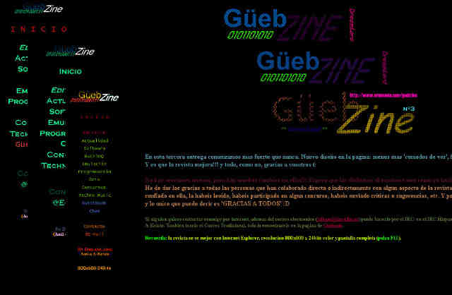

GüebZine 
========= 
by Joan Alba Maldonado (joanalbamaldonadoNO_SPAM_PLEASE AT gmail DOT com, without NO_SPAM_PLEASE)

Webzine which I started in 1998 using HTML and a little bit of JavaScript.

Version: 1st, 2nd, 3rd and 4th (beta) issues 
- Date: 1998 to 2000 or 2001 (approximately)

## Description

Webzine which I started in 1998 (third and last official issue was released in 1999), creating it with HTML and a little bit of JavaScript. It was hosted on EmuM@nia (emumania.com) which was one of the most famous Spanish emulation web sites before it disappeared in 2002. It had different contributors (DaTaR, Erterks, ARROW, [Lolo], CHIP, Scumnok, [[[ALX]]]...) who wrote some sections and/or helped in some way.

Only three issues where released (all using Spanish as the main language). The fourth issue, which I was doing until 2000 or 2001 (I cannot remember), was never neither finished nor released but the last version I could found is included in this repository.

First three issues contained sections about software, emulation (including another older e-zine called Emu Mania by DaTaR), games, pastimes, programming (with a C course), hacking and cracking, music, web design course (by Erterks), contests (games contest, animations contest, images contest, music contests, homepages contest), a puzzle story (collaborative fiction) made by different contributors which was updated in every issue, news, interviews, links, chat, guestbook, etc.

The fourth version was going to contain many more things, as for example sections about IRC, ICQ, body piercing and tattoos, Pokémon, humour, patchwork, Star Wars, Macintosh, Amiga, overclocking, abandonware, retrocomputing, retrogaming (with an article by Scumnok), parapsychology, ASCII art, poems, sayings and proverbs, TV and radio, infographics, 3D, ecology, drugs, rankings, art gallery, point-and-click adventures, interactive fiction, game mods and maps, gastronomy and recipes, mobile phones and GSM, Visual Basic course (by CHIP), JavaScript course (by [Lolo]), Java applets development, underground culture and many many more.

This repository also contains installers and launchers (one of them was made by CHIP) and different versions of the official website where people could download this webzine.

Found on Internet Archive (Archive.org):
http://web.archive.org/web/20010604023337/http://emumania.com:80/guebzine/
http://web.archive.org/web/20010818152248/http://emumania.com:80/guebzine/